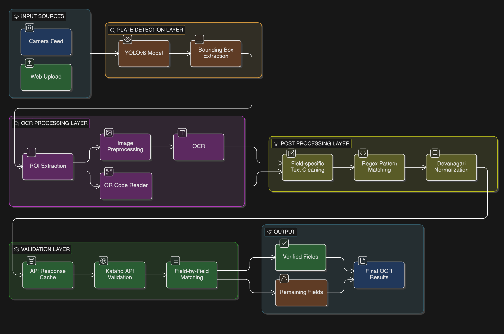
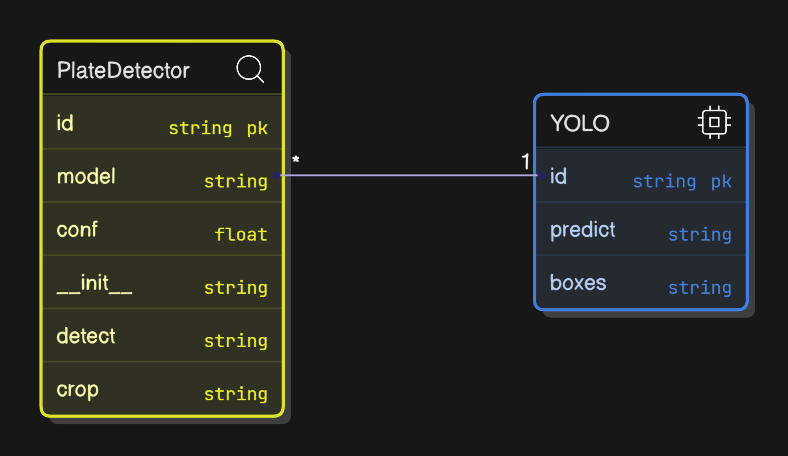
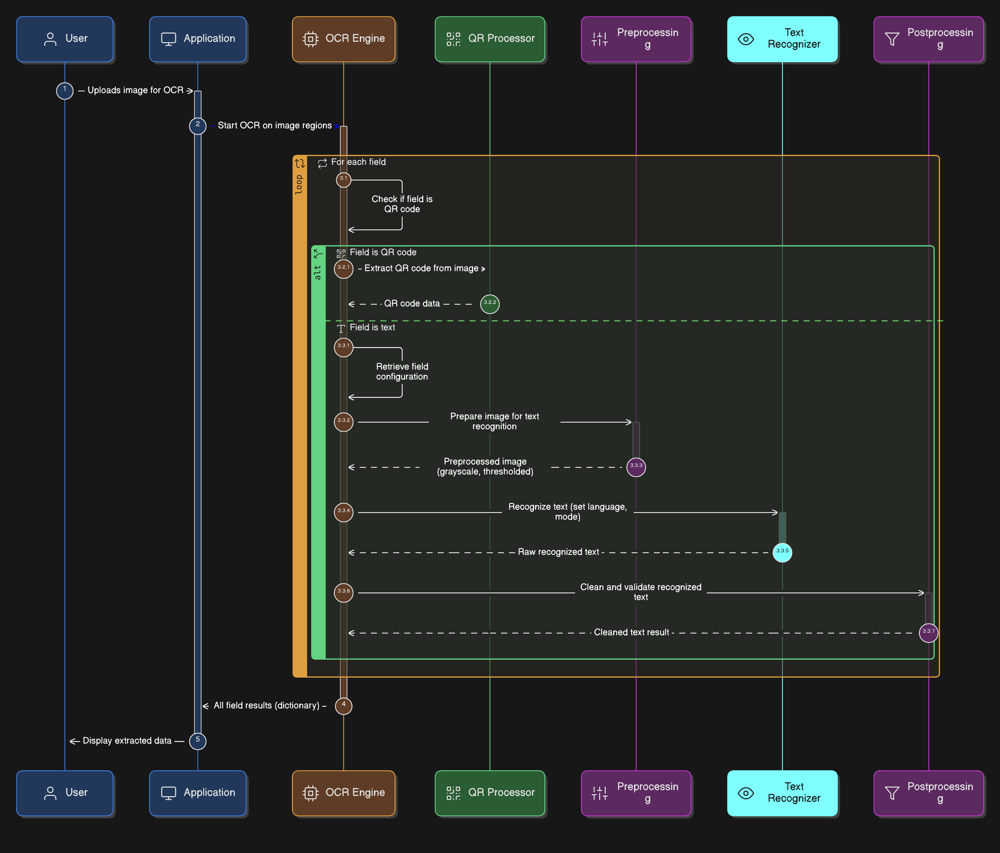
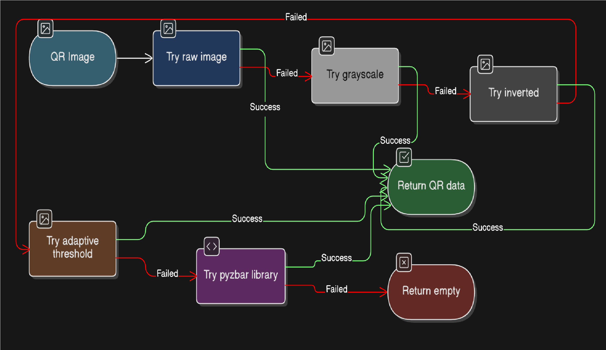
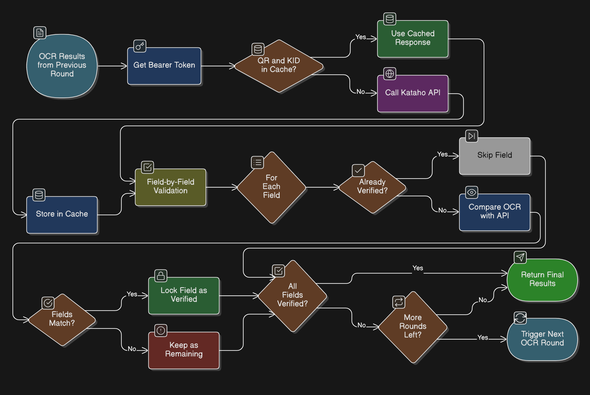
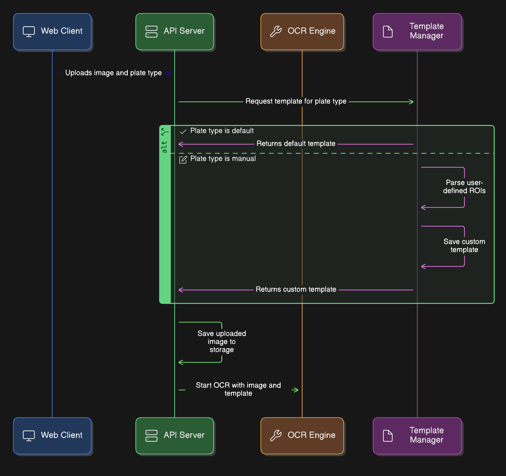
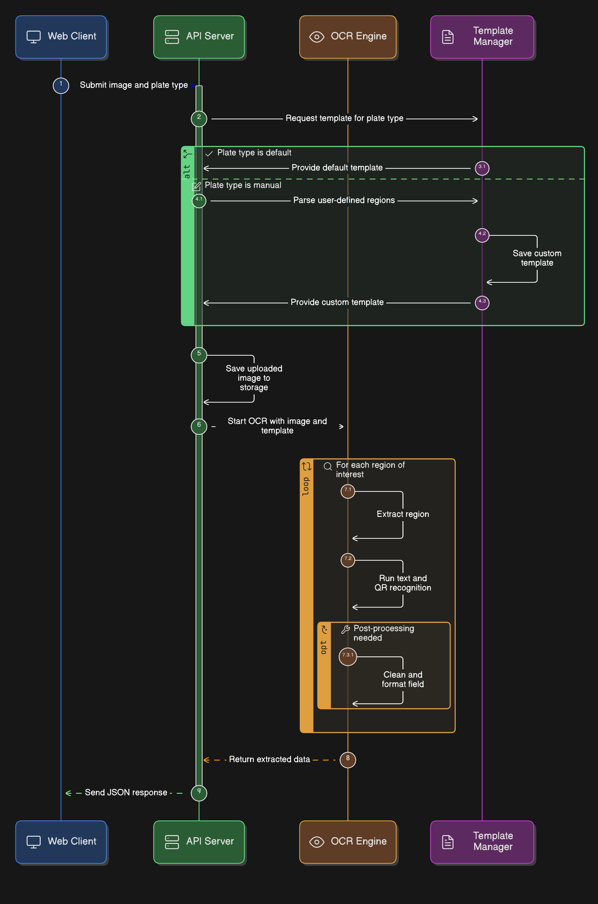
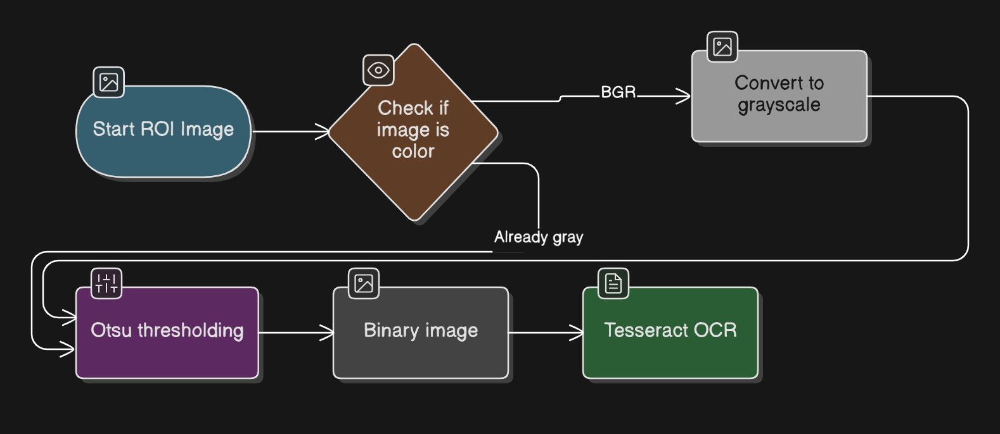
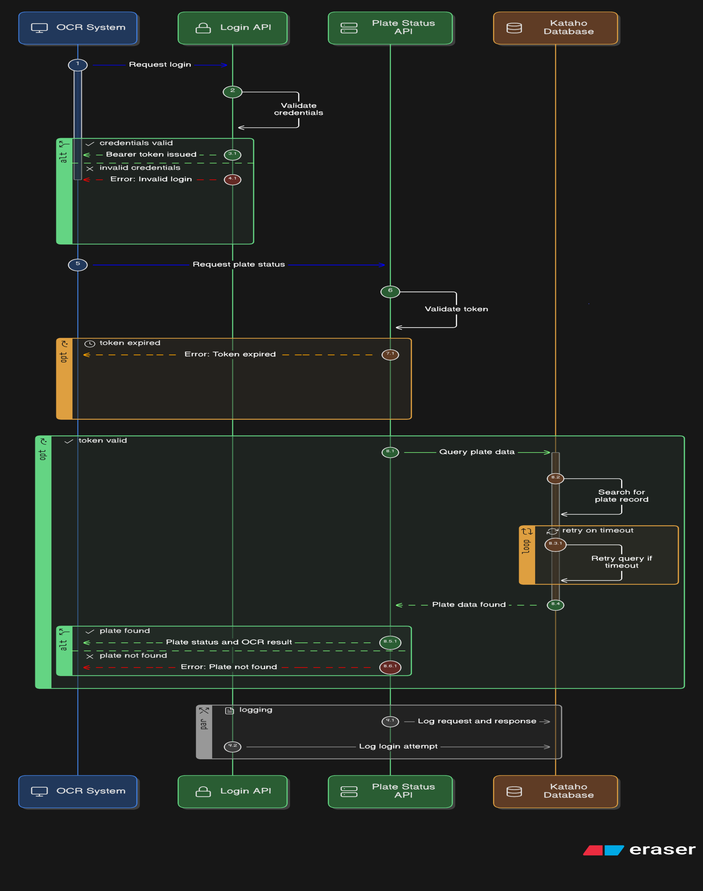

# Optical Nepali OCR System - Complete Documentation

## Table of Contents
1. [System Overview](#system-overview)
2. [Architecture Overview](#architecture-overview)
3. [Core Components](#core-components)
4. [Data Flow & Pipeline](#data-flow--pipeline)
5. [Technical Implementation](#technical-implementation)
6. [API Integration](#api-integration)
7. [Configuration](#configuration)
8. [Usage](#usage)

---

## System Overview

The **Optical Nepali OCR System** is a comprehensive computer vision and OCR solution designed to automatically detect, extract, and validate information from Nepali address plates (Kataho plates). The system combines:

- **YOLOv8 object detection** for plate localization
- **Multi-language Tesseract OCR** (Nepali, Hindi, English) for text extraction
- **QR code detection and decoding** for unique identifiers
- **Backend API validation** against the Kataho database
- **Progressive multi-round OCR** for accuracy improvement
- **Web interface** for manual OCR processing

### Key Features
- ✅ Real-time plate detection from 4K camera feed
- ✅ Multi-script OCR (Devanagari digits, Nepali, Hindi, English)
- ✅ Intelligent field-specific post-processing
- ✅ API-based validation with caching
- ✅ Progressive verification across multiple rounds
- ✅ FastAPI web service for on-demand OCR

---

## Architecture Overview


---

## Core Components

### 1. Plate Detector (`Plate_Detector/`)

**Purpose**: Detect plate regions in images using YOLO object detection

#### Key Files:
- [`plate_detector.py`](file:///c:/Users/Hp/Desktop/Optical_Nepali_OCR/Plate_Detector/plate_detector.py) - Main detector class
- [`detector_utils.py`](file:///c:/Users/Hp/Desktop/Optical_Nepali_OCR/Plate_Detector/detector_utils.py) - Utility functions

**Architecture**:


**Key Functions**:
- `detect(frame)` - Returns list of `(x1, y1, x2, y2, confidence)` tuples
- `crop(frame, box)` - Extracts plate region from frame
- `shrink_bbox()` - Reduces bbox by percentage to remove borders

---

### 2. OCR Engine (`OCR_Engine/`)

**Purpose**: Extract text from ROIs using Tesseract with field-specific configurations

#### Key Files:
- [`ocr_engine.py`](file:///c:/Users/Hp/Desktop/Optical_Nepali_OCR/OCR_Engine/ocr_engine.py) - Main OCR orchestrator
- [`engine_utils.py`](file:///c:/Users/Hp/Desktop/Optical_Nepali_OCR/OCR_Engine/engine_utils.py) - Preprocessing and Tesseract wrapper
- [`plate_postprocess.py`](file:///c:/Users/Hp/Desktop/Optical_Nepali_OCR/OCR_Engine/plate_postprocess.py) - Field-specific text cleaning

**OCR Pipeline**:


**Field-Specific OCR Configurations**:
| Field | Language | PSM | OEM | Notes |
|-------|----------|-----|-----|-------|
| KID_No | `eng` | 6 | 3 | English digits with hyphens |
| Plus_Code | `eng` | 6 | 3 | Google Plus Code format |
| Local_Address | `hin` | 11 | 3 | Hindi/Devanagari script |
| City | `hin` | 11 | 3 | Devanagari characters only |
| Ward_Address | `nep` | 11 | 3 | Nepali script with numbers |
| QR_Code | N/A | N/A | N/A | Uses CV2 QRCodeDetector |

---

### 3. QR Processor (`QR_Processor/`)

**Purpose**: Robust QR code detection with multiple fallback strategies

#### Key Files:
- [`QR_utils.py`](file:///c:/Users/Hp/Desktop/Optical_Nepali_OCR/QR_Processor/QR_utils.py) - QR reading with preprocessing
- [`qr_reader.py`](file:///c:/Users/Hp/Desktop/Optical_Nepali_OCR/QR_Processor/qr_reader.py) - Standalone QR reader

**QR Detection Strategy**:


---

### 4. Backend Validation (`Plate_Detector/Plate_Backend/`)

**Purpose**: Validate OCR results against Kataho API with progressive field locking

#### Key Files:
- [`backend_pipeline.py`](file:///c:/Users/Hp/Desktop/Optical_Nepali_OCR/Plate_Detector/Plate_Backend/backend_pipeline.py) - Main validation orchestrator
- [`api_calls.py`](file:///c:/Users/Hp/Desktop/Optical_Nepali_OCR/Plate_Detector/Plate_Backend/api_calls.py) - API communication
- [`backend_utils.py`](file:///c:/Users/Hp/Desktop/Optical_Nepali_OCR/Plate_Detector/Plate_Backend/backend_utils.py) - Text normalization utilities
- [`api_num_conversion.py`](file:///c:/Users/Hp/Desktop/Optical_Nepali_OCR/Plate_Detector/Plate_Backend/api_num_conversion.py) - Nepali-to-English digit conversion

**Validation Flow**:


----

**Progressive Verification Logic**:
- Each OCR round extracts text from all fields
- API is called once per unique KID+QR combination (cached)
- Fields are compared individually against API response
- Once a field matches, it's **locked** and never re-OCRed
- Process continues until all fields verified OR max rounds reached

---

### 5. Post-Processing (`OCR_Engine/plate_postprocess.py`)

**Purpose**: Clean raw OCR text using field-specific regex patterns

**Cleaning Strategies by Field**:

| Field | Cleaning Strategy | Example |
|-------|------------------|---------|
| **KID_No** | Extract pattern: `XX-XXX-XXXX-XXXX` | `KID: 01-234-5678-9012` → `01-234-5678-9012` |
| **Plus_Code** | Extract Google Plus Code format | `PLUS CODE: 7MHM+WX` → `7MHM+WX` |
| **Local_Address** | Keep Devanagari only, trim noise | `१२३ काठमाडौं !!` → `काठमाडौं` |
| **Ward_Address** | Normalize "वडा नं" pattern | `काठमाडौं वडार्ने २६` → `काठमाडौं, वडा नं २६` |
| **City** | Devanagari chars only | `काठमाडौं123` → `काठमाडौं` |
| **Kataho_Address** | Extract: `DD word word DDDD` | `०१ काठमाडौं महानगर १२३४` |

**Devanagari Normalization**:
```python
# Common OCR errors in Nepali text
"मागे" → "मार्ग"
"काठमाडौीं" → "काठमाडौं"
"वडा न" → "वडा नं"
"ीं+" → "ं"  # Remove duplicate matras
```

---

## Data Flow & Pipeline

### Live Camera OCR Pipeline (`ocr_main_live.py`)


**Round-Based OCR Logic**:
1. **Detection Hold**: Plate must be visible for `HOLD_SECONDS` (default: 5s)
2. **High-Res Capture**: Take 4K snapshot when hold completes
3. **OCR Round**: Extract all fields, validate with API
4. **Progressive Locking**: Lock verified fields
5. **Repeat**: Continue until `MAX_OCR_ROUNDS` (default: 5) or 100% verified

---

### Web API Pipeline (`web/backend/main.py`)


**API Endpoints**:
- `POST /ocr` - Run OCR on uploaded image
  - **Parameters**:
    - `plate_type`: `"default"` or `"manual"`
    - `image`: Image file (multipart/form-data)
    - `rois`: JSON string (if manual mode)
  - **Response**:
    ```json
    {
      "status": "success",
      "plate_type": "default",
      "ocr_result": {
        "KID_No": "01-234-5678-9012",
        "Plus_Code": "7MHM+WX",
        "Local_Address": "काठमाडौं",
        "Ward_Address": "काठमाडौं महानगरपालिका, वडा नं २६",
        "City": "काठमाडौं",
        "QR_Code": "KATAHO_12345"
      }
    }
    ```

---

## Technical Implementation

### ROI Template System

**Template Format** (`Plate_Templates/Templates/default_plate_template.json`):
```json
{
  "KID_No": [0.1, 0.05, 0.6, 0.15],
  "Plus_Code": [0.65, 0.05, 0.95, 0.15],
  "Local_Address": [0.1, 0.25, 0.9, 0.4],
  "Ward_Address": [0.1, 0.5, 0.9, 0.65],
  "City": [0.1, 0.7, 0.5, 0.85],
  "QR_Code": [0.85, 0.7, 0.98, 0.95]
}
```

**Coordinates**: `[x1, y1, x2, y2]` as **normalized fractions** (0-1) relative to plate bounding box

**ROI Extraction**:
```python
plate_w = x2 - x1  # Plate width
plate_h = y2 - y1  # Plate height

for field, coords in ROIS.items():
    rx1 = int(x1 + coords[0] * plate_w)  # Scale to absolute coords
    ry1 = int(y1 + coords[1] * plate_h)
    rx2 = int(x1 + coords[2] * plate_w)
    ry2 = int(y1 + coords[3] * plate_h)
    
    roi = plate_crop[ry1:ry2, rx1:rx2]  # Extract region
```

---

### Image Preprocessing Pipeline



**Implementation**:
```python
def preprocess_for_ocr(image):
    # Convert to grayscale
    gray = cv2.cvtColor(image, cv2.COLOR_BGR2GRAY) if len(image.shape) == 3 else image.copy()
    
    # Otsu's automatic thresholding
    _, thresh = cv2.threshold(
        gray, 0, 255,
        cv2.THRESH_BINARY + cv2.THRESH_OTSU
    )
    
    return thresh
```

---

### API Integration Architecture

**Kataho API Workflow**:


**API Endpoints**:
1. **Login**: `https://kataho.app/api/login`
   - Request:
     ```json
     {
       "username": "kataho_developer",
       "password": "Hello@world123",
       "device_token": "ocr_device"
     }
     ```
   - Response: `{"data": {"api_token": "..."}}`

2. **Plate Status Check**: `https://kataho.app/api/plate-status-check`
   - Query Params:
     - `kataho_code`: KID number (e.g., `01-234-5678-9012`)
     - `kid_code`: QR extracted ID
   - Headers: `Authorization: Bearer {token}`
   - Response:
     ```json
     {
       "success": true,
       "ocr_result": {
         "KID_No": "...",
         "Local_Address": "...",
         "Kataho_Address": "...",
         "Plus_Code": "...",
         "Ward_Address": "...",
         "City": "...",
         "QR_Code": "..."
       }
     }
     ```

---

## Configuration

**Main Config File**: [`config.py`](file:///c:/Users/Hp/Desktop/Optical_Nepali_OCR/config.py)

### Key Configuration Parameters

```python
# OCR Settings
IMG_SIZE = 32              # CNN resize (future use)
LANG = 'nep'               # Default Tesseract language
DEFAULT_OEM = 1            # OCR Engine Mode
DEFAULT_PSM = 6            # Page Segmentation Mode

# Field-specific OCR configs
FIELD_OCR_CONFIG = {
    "KID_No": {"lang": "eng", "psm": 6, "oem": 3},
    "Plus_Code": {"lang": "eng", "psm": 6, "oem": 3},
    "Local_Address": {"lang": "hin", "psm": 11, "oem": 3},
    "City": {"lang": "hin", "psm": 11, "oem": 3},
    "Ward_Address": {"lang": "nep", "psm": 11, "oem": 3},
}

# Model Paths
TESSERACT_PATH = r"C:\Program Files\Tesseract-OCR\tesseract.exe"
YOLO_MODEL = r"C:\...\models\plate_yolo.pt"
JSON_PATH = r"C:\...\Plate_Templates\Templates\default_plate_template.json"

# Camera Settings
LIVE_CAMERA = 0            # Camera index
HOLD_SECONDS = 5           # Detection stability time
MAX_OCR_ROUNDS = 5         # Maximum validation rounds

# API Credentials
username = "kataho_developer"
password = "Hello@world123"
LOGIN_URL = "https://kataho.app/api/login"
DATA_URL = "https://kataho.app/api/plate-status-check"

# Output Directories
OUTPUT_DIR = r"C:\...\Scan_Images\Plate_Scans"    # High-res scans
ROI_DIR = r"C:\...\Scan_Images\ROI"               # Extracted ROIs
```

---

## Usage

### 1. Live Camera OCR

**Run the main live system**:
```bash
python ocr_main_live.py
```

**Workflow**:
1. System opens 4K camera feed
2. Displays live preview with plate detection boxes
3. When plate stable for 5+ seconds:
   - Captures high-res snapshot
   - Extracts ROIs
   - Runs OCR
   - Validates with API
   - Prints verified fields
4. Repeats for up to 5 rounds
5. Exits when all fields verified or max rounds reached

**Live Display**:
- **Green boxes**: Plate detections
- **Red boxes**: ROI regions
- **Labels**: Field names
- **ESC key**: Exit

---

### 2. Web API Service

**Start the FastAPI server**:
```bash
cd web/backend
uvicorn main:app --reload --host 0.0.0.0 --port 8000
```

**Test with cURL**:
```bash
curl -X POST "http://localhost:8000/ocr" \
  -F "plate_type=default" \
  -F "image=@path/to/plate.jpg"
```

**Web Interface**: Navigate to `web/frontend/` for the HTML interface

---

### 3. Standalone Testing

**Test OCR on single field**:
```bash
python test_model.py
```

---

## Dependencies

**Requirements** ([`requirements.txt`](file:///c:/Users/Hp/Desktop/Optical_Nepali_OCR/requirements.txt)):
```
opencv-python       # Image processing
pytesseract        # OCR engine wrapper
numpy              # Array operations
pyzbar             # QR code fallback
uvicorn            # ASGI server
fastapi            # Web framework
python-multipart   # File uploads
ultralytics        # YOLOv8
torch              # PyTorch (YOLO backend)
```

**External Dependencies**:
- **Tesseract OCR**: Install from [GitHub](https://github.com/UB-Mannheim/tesseract/wiki)
  - Required traineddata: `eng.traineddata`, `hin.traineddata`, `nep.traineddata`
- **YOLO Model**: `models/plate_yolo.pt` (custom trained)

---

## System Workflow Summary


---

## Advanced Features

### 1. API Response Caching
- Cache key: `QR_ID`
- Prevents redundant API calls within same session
- Reduces latency and API load

### 2. Progressive Field Verification
- **Problem**: Single OCR round may have partial errors
- **Solution**: 
  - Lock correctly matched fields across rounds
  - Only re-OCR unverified fields
  - Accumulate verified fields progressively

### 3. Nepali Digit Conversion
- Converts Devanagari digits (०-९) to English (0-9)
- Used in Kataho_Address field matching
- Example: `०१ काठमाडौं` → `01 काठमाडौं`

### 4. Multi-Strategy QR Detection
- Tries 5 different preprocessing methods
- Falls back to pyzbar if OpenCV fails
- Handles rotated, blurry, or inverted QR codes

---

## File Structure

```
Optical_Nepali_OCR/
│
├── config.py                           # Global configuration
├── ocr_main_live.py                    # Main live camera system
├── test_model.py                       # Standalone testing script
├── requirements.txt                    # Python dependencies
│
├── models/
│   └── plate_yolo.pt                   # YOLOv8 trained model
│
├── Plate_Templates/
│   └── Templates/
│       └── default_plate_template.json # ROI coordinates
│
├── Plate_Detector/
│   ├── plate_detector.py               # YOLO detector wrapper
│   ├── detector_utils.py               # Bbox utilities
│   └── Plate_Backend/
│       ├── backend_pipeline.py         # Validation orchestrator
│       ├── api_calls.py                # Kataho API client
│       ├── backend_utils.py            # Text matching utilities
│       └── api_num_conversion.py       # Nepali-English conversion
│
├── OCR_Engine/
│   ├── ocr_engine.py                   # Main OCR orchestrator
│   ├── engine_utils.py                 # Preprocessing + Tesseract wrapper
│   └── plate_postprocess.py            # Field-specific cleaning
│
├── QR_Processor/
│   ├── QR_utils.py                     # Multi-strategy QR reader
│   ├── qr_reader.py                    # CLI QR reader
│   └── qr_extractor.py                 # QR extraction (if exists)
│
├── web/
│   ├── backend/
│   │   └── main.py                     # FastAPI server
│   └── frontend/
│       └── (HTML/JS files)             # Web interface
│
└── Scan_Images/
    ├── Plate_Scans/                    # High-res snapshots
    └── ROI/                            # Extracted field images
```

---

## Performance Considerations

1. **Camera Resolution**: 4K (4208x3120) for high-quality OCR
2. **Detection Confidence**: 0.4 threshold for YOLO
3. **Hold Time**: 5 seconds ensures stable detection
4. **Max Rounds**: 5 rounds balances accuracy vs. speed
5. **API Caching**: Prevents redundant calls for same plate
6. **Bbox Shrinking**: 1-2% reduction removes border noise

---

## Future Enhancements

-  Multi-plate simultaneous processing
-  Real-time field confidence scoring
-  Database storage for OCR history
-  Machine learning-based post-correction
-  Mobile app integration
-  Offline validation mode
-  Multi-camera support

---

**Documentation Generated**: 2026-02-09  
**System Version**: 1.0  
**Author**: Optical Nepali OCR Project Team
